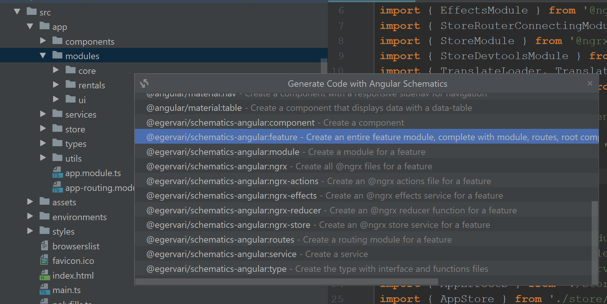
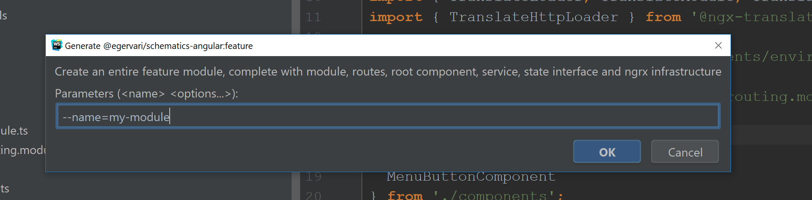

# Angular Schematics for Productivity and Consistency

Developing large-scale web-applications is *hard*, and without a lot of
experience building large Angular applications, it's very easy to make
an architectural or structural mistake that could cost your team a lot
of money and time to fix down the road once that mistake is realized.

The schematics in this library will help your team develop Angular
applications that are consistent and have an architecture/folder
structure that will scale for extremely large projects right from the
get-go.

The output of these schematics is based on many years of experience
building large-scale projects in Angular, and have been used in
applications that contain several hundred-thousand lines of code. Thus,
the opinions and ideas behind these schematics have been battle-tested
and proved to prevent and solve scalability problems many people run
into when building large-scale Angular projects.

## Installation

To add these schematics to your angular-cli project, type the
following in the console at the root of your project:

```bash
npm install @egervari/schematics-angular --save-dev
```

To run schematics from your console, also add the following global
npm library:

```bash
npm install -g @angular-devkit/schematics-cli
```

### Using Schematics Via Console

#### Adding prettier and overwriting TSLint and Prettier rules

To add prettier (if you currently don't have it installed) and use
Rangle's preferred starting point for TSLint and Prettier rules, run
the following schematic from your console:

```bash
schematics @egervari/schematics-angular:tslint-and-prettier
```

You should see the following updates to your project:

```bash
    Added "prettier" into devDependencies
    Added "tslint-config-prettier" into devDependencies
CREATE /prettier.config.js (173 bytes)
UPDATE /tslint.json (869 bytes)
UPDATE /package.json (2552 bytes)
```

#### Creating Features

To create a feature module containing components, routes, services,
types and isolated ngrx infrastructure, you must specify the feature's
`name`, `path` and your project's component `prefix`:

```bash
schematics @egervari/schematics-angular:feature --name=my-feature --path=src/app --prefix=rng
```

If your project currently does not have a `/features` folder, the
schematic will create one for you.

You should see the following files be created/updated when running this
schematic:

```bash
CREATE /src/app/features/my-feature/my-feature-routing.module.ts (373 bytes)
CREATE /src/app/features/my-feature/my-feature.module.ts (687 bytes)
CREATE /src/app/features/my-feature/components/my-feature/my-feature.component.html (0 bytes)
CREATE /src/app/features/my-feature/components/my-feature/my-feature.component.scss (12 bytes)
CREATE /src/app/features/my-feature/components/my-feature/my-feature.component.ts (226 bytes)
CREATE /src/app/features/my-feature/components/index.ts (52 bytes)
CREATE /src/app/features/my-feature/services/my-feature.service.ts (204 bytes)
CREATE /src/app/features/my-feature/store/my-feature.actions.ts (239 bytes)
CREATE /src/app/features/my-feature/store/my-feature.effects.ts (477 bytes)
CREATE /src/app/features/my-feature/store/my-feature.reducer.ts (560 bytes)
CREATE /src/app/features/my-feature/store/my-feature.store.ts (312 bytes)
CREATE /src/app/features/my-feature/types/my-feature-state/my-feature-state.functions.ts (163 bytes)
CREATE /src/app/features/my-feature/types/my-feature-state/my-feature-state.interface.ts (59 bytes)
UPDATE /src/app/app-routing.module.ts (627 bytes)
```

#### Creating Modules

Sometimes you wish to create modules outside of your routes. They are
not really features, but reusable pieces of code the rest of the app
can share. To create such a module, run the following schematic:

```bash
schematics @egervari/schematics-angular:module --name=my-module --path=src/app --prefix=rng
```

If your project currently does not have a `/modules` folder, the
schematic will create one for you.

You should see the following files be created/updated when running this
schematic:

```bash
CREATE /src/app/modules/my-module/my-module.module.ts (571 bytes)
CREATE /src/app/modules/my-module/services/my-module.service.ts (203 bytes)
CREATE /src/app/modules/my-module/store/my-module.actions.ts (236 bytes)
CREATE /src/app/modules/my-module/store/my-module.effects.ts (472 bytes)
CREATE /src/app/modules/my-module/store/my-module.reducer.ts (547 bytes)
CREATE /src/app/modules/my-module/store/my-module.store.ts (310 bytes)
CREATE /src/app/modules/my-module/types/my-module-state/my-module-state.functions.ts (159 bytes)
CREATE /src/app/modules/my-module/types/my-module-state/my-module-state.interface.ts (58 bytes)
UPDATE /src/app/app.module.ts (2445 bytes)
```

#### Creating Components

Creating components is equally easy - make sure to point the `path`
to the module/feature folder you wish the component to be located:

```bash
schematics @egervari/schematics-angular:component --name=my-form --path=src/app --prefix=rng
```

If your path currently does not have a `/components` folder, the
schematic will create one for you.

You should see the following files be created/updated when running this
schematic:

```bash
CREATE /src/app/components/my-form/my-form.component.html (0 bytes)
CREATE /src/app/components/my-form/my-form.component.scss (12 bytes)
CREATE /src/app/components/my-form/my-form.component.ts (214 bytes)
UPDATE /src/app/components/index.ts (192 bytes)
UPDATE /src/app/app.module.ts (2484 bytes)
```

#### Creating Services

Creates a service and updates the containing module file.

Note that this schematic does not require a `prefix` parameter.

```bash
schematics @egervari/schematics-angular:service --name=my-api --pat
h=src/app
```

If your path currently does not have a `/services` folder, the
schematic will create one for you.

You should see the following files be created/updated when running this
schematic:

```bash
CREATE /src/app/services/my-api.service.ts (200 bytes)
UPDATE /src/app/app.module.ts (2561 bytes)
```

#### Creating Types

Creates a paired interface and functions file for a given model.

Note that this schematic does not require a `prefix` parameter.

```bash
schematics @egervari/schematics-angular:type --name=user-profile --path=src/app
```

If your path currently does not have a `/types` folder, the
schematic will create one for you.

You should see the following files be created when running this
schematic:

```bash
CREATE /src/app/types/user-profile/user-profile.functions.ts (150 bytes)
CREATE /src/app/types/user-profile/user-profile.interface.ts (56 bytes)
```

### Using Schematics Through WebStorm

To use schematics in WebStorm, right-click on a folder, select
**'New'**, then select **'Angular Schematic'**, and then select any
schematic from the following list:



For the parameters input, WebStorm will pass many of the options - such
as project name and path - on your behalf, so all you have to do is set
the `name` parameter for most schematics and you're all set:



## Building and testing

To build the source code, run:

```bash
npm run build
```

After the schematics are built, to run them locally from the project
root, run:

```bash
cd dist
schematics .:feature --name=app --path=src/app
```

## Linting and Prettier

To clean up the source code, run:

```bash
npm run fix
```

## Publishing

To publish this to npm, run the following commands:

```bash
npm version major/minor/patch
npm run build
npm run publish
```

### Quickly create a patch version

To quickly create a patch version, instead of going through all of the
build and publish commands manually, instead run:

```bash
npm run release-patch
```
